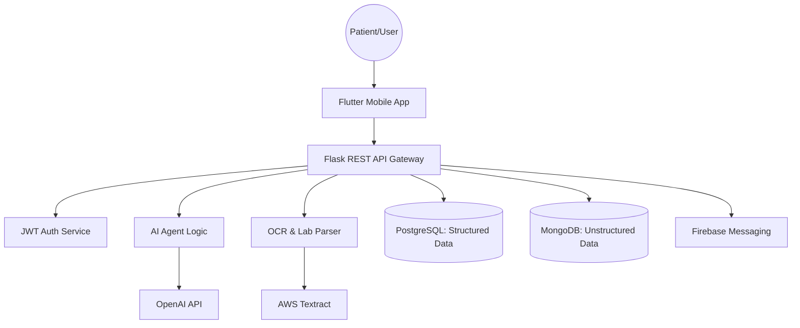

# System Design - Team NIGHTRIDERS

**Team Name**: NIGHTRIDERS  
**Team Leader**: B. Sai Pranav

---

## 🏛 Architecture Overview
The system follows a modern microservices-compatible architecture designed for high availability and scalability.

## 💾 Database Schema

### PostgreSQL (Structured)
- **Users**: Personal info, medical meta-data.
- **Prescriptions**: Drug names, dosages, schedules.
- **Reminders**: Time-stamped medication alerts.
- **Appointments**: Scheduled follow-ups and clinic info.

### MongoDB (Unstructured)
- **ChatHistory**: Contextual conversation logs.
- **LabReports**: Raw OCR data and simplified explanations.
- **KnowledgeBase**: Symptom-disease mapping datasets.

## 🌉 Communication Patterns
- **RESTful API**: Standard communication between Frontend and Backend.
- **Real-time Updates**: Polishing features like chat and medication alerts.
- **Secure Tunneling**: HTTPS for all external communications.
